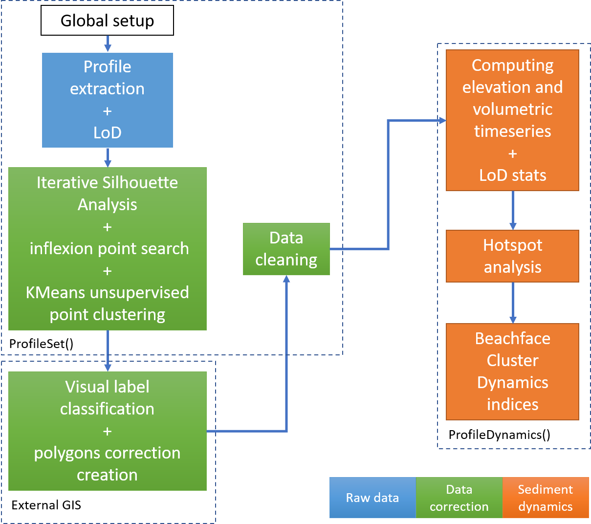

# Methods used and references

Sandpyper has been conceived to simplify topographic profile data extraction and exploration from large numbers of Digital Surface Models (DSMs) and orthophotos in a sandy beach monitoring project. It is fundamentally an adaptation of scripts and methods that the author, [Mr. Nicolas Pucino](https://www.researchgate.net/profile/Nicolas-Pucino) created as part of his PhD in optical remote sensing of coastal morphodynamics at Deakin University, Victoria, Australia. Sandpyper directly supported an important publication freely available here, titled "[Citizen science for monitoring seasonal-scale beach erosion and behaviour with aerial drones](https://www.nature.com/articles/s41598-021-83477-6#Abs1)". Therefore, the following methods explanation are mainly sourced from this publication and slightly extended with images.
 

Sandpyper makes use of machine learning,  limit of detection analysis, discrete Markov chain models and spatial autocorrelation analysis to perform its standard analysis routine, which can be depicted in the following scheme:

As you can see, Sandpyper general pipeline involves a first stage of raw data extraction, followed by a data correction phase and finally, a series of sediment dynamics insights can be derived.  

Currently, Sandpyper is intended for profile-based analysis, however, it is being developed to achieve the same goals with a raster-based approach.

This package can be used with different environments and for different applications. However, it has some features specifically designed to help with the cleaning of points from unwanted noise generated by working with __Structure from Motion and UAVs in coastal environments.__
