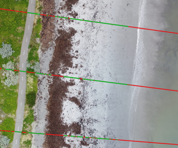
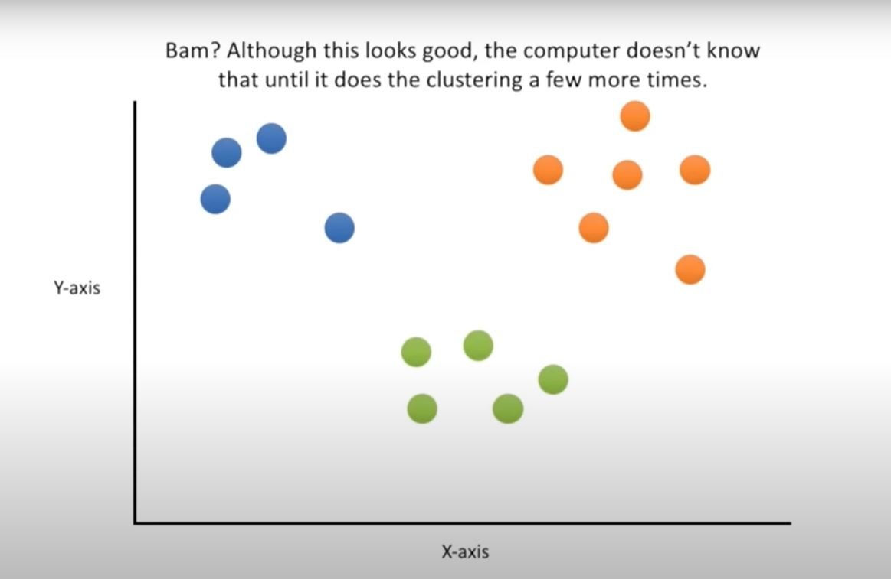
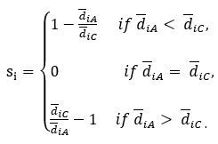
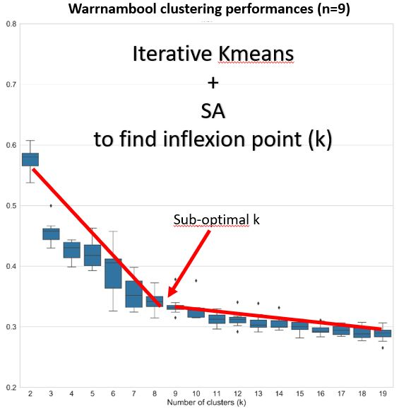
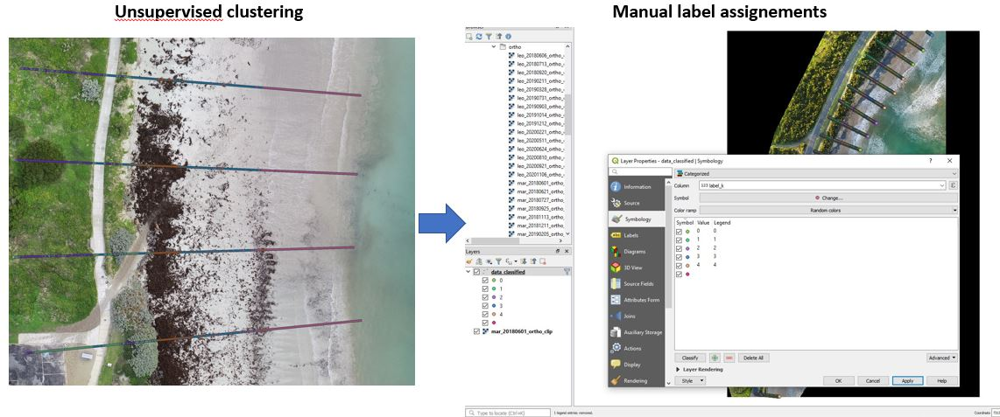
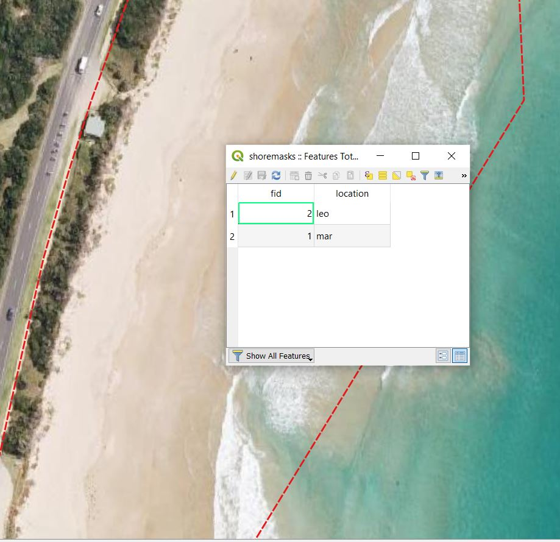
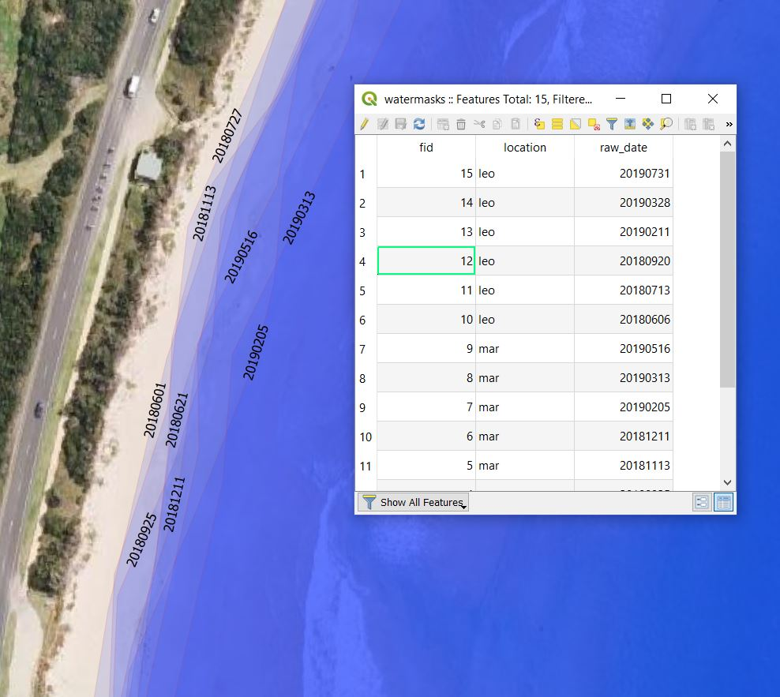
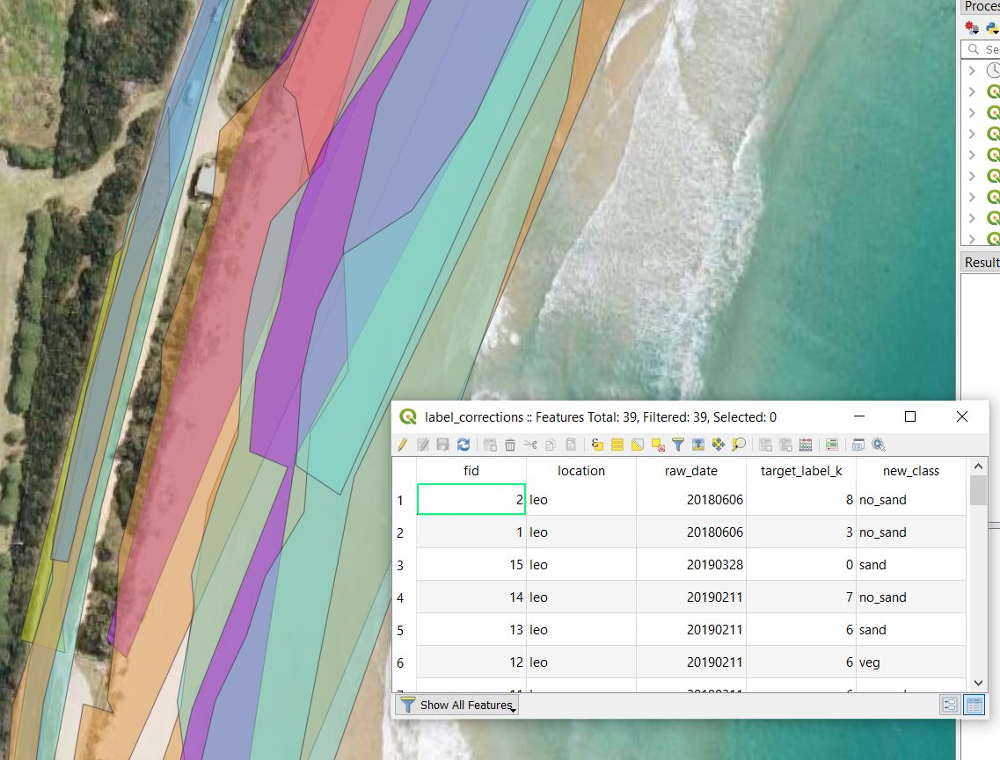

# Methods for sand labelling and classification




As the Structure from Motion pipeline assumes tie-points to be fixed during multi-view stereo-pairing, the swash zone created obvious artifacts that would interfere with an accurate representation of the beach topography. Its extent and location is highly dynamic, due to the combined effect of tidal and water level variations, planimetric beach adjustments and variable survey times.  
Also, dune vegetation, beach wracks and anything that was neither sand nor a fixed feature (like rock walls or fences) on the beach needed to be removed to exclusively obtain sand-specific volumetric changes and accurate profiles evolution.
For this reason, Sandpyper uses a machine learning algorithm to semi-automatically classify sand and non-sand points (objects, seaweed wracks, vegetation), facilitating the cleaning of big datasets.

In order to classify sand and no-sand points sampled across transects, Sandpyper facilitates the use of Silhouette Analysis (SA) method to propose a sub-optimal __number of clusters k__ to be used by the unsupervised KMeans clustering algorithm. Following the unsupervised procedure, Sandpyper helps in further cleaning the dataset by providing it with correction polygons (in case the user wants to fine-tune the KMeans assigned labels), watermasks (to further mask out water and swash) and shoremasks (to clip the area of study to not too far landward from the foredune, if existent).

A typical Sandpyper pipeline consists of:

1. Automated iterative Silhouette Analysis with inflexion point search at the site level, implemented with `get_sil_location()` function
2. Inflexion points search, implemented with `get_opt_k()` function
3. Run KMeans with the identified sub-optimal k, implemented with the `ProfileSet.kmeans_sa()` method.
4. Visual assesment of KMeans generated labels and creation of class dictionaries and correction polygons in a GIS
5. Semi-automated classification and cleaning, implemented with `ProfileSet.cleanit()` method.


## Unsupervised clustering with KMeans
KMeans is one of the most used, versatile and readily available clustering algorithms in data mining ([Wu et al., 2007](http://dx.doi.org/10.1007/s10115-007-0114-2)) and
showed its value on partitioning SfM-MVS derived coastal point clouds ([Callow et al., 2018](http://dx.doi.org/10.1007/s10115-007-0114-2)).
For a general overview of clustering algorithms with specific attention on KMeans algorithm,
please refer to [Jain (2010)](https://www.sciencedirect.com/science/article/abs/pii/S0167865509002323?via%3Dihub).

Sandpyper implements Elkan's KMeans algorithm ([Elkan, 2003](https://www.aaai.org/Papers/ICML/2003/ICML03-022.pdf)) with triangle inequality acceleration via [sklearn](https://scikit-learn.org/stable/modules/generated/sklearn.cluster.KMeans.html) package, with the following parameters:
1. initial cluster centers selected with k-means++
2. 300 maximum iterations per run
3. inertial tolerance of 0.0001
4. precomputed distances if n_samples * n_clusters < 12 million

Have a look at this short and easy video about the intuition of KMeans.<br>

[Watch here](https://www.youtube.com/watch?v=4b5d3muPQmA)


## Silhouette Analysis (SA)

The Silhouette Analysis (SA) method is a simple graphical and analytical method to measure how tight and compact the clusters are (overall), while also indicating how well each observation fits (silhouette coefficient) within the assigned partition or cluster ([Rousseeuw, 1987](https://www.sciencedirect.com/science/article/pii/0377042787901257?via%3Dihub)).

For instance, let’s consider N=11 observations partitioned into k=3 clusters A,B,C and observation   assigned to cluster A. In the following diagram, the feature space has been limited to 2 features for illustration purposes.


SA in the example can be summarised in the following steps:
1. : Compute the mean dissimilarity of  to the other elements within A.
2. : Compute the mean dissimilarity of  to the other elements of any remaining clusters different than A.
3. : Find   other cluster (neighbour) by finding the minimum 

In the example, , in fact it is easily seen that the average lengths of all segments connecting  to the elements in cluster C is smaller than that of to cluster B.
The neighbour C could be considered  as a potential candidate for a misinterpreted partitioning from the clustering algorithm (KMeans, in our case). Thus, the silhouette coefficient  of   in A  can now be computed as:




It follows that:
1. The silhouette coefficient of any observation can be computed and ranges from -1 to 1.
2. When of positive sign, the closest  is to 1, the better fit in its current cluster
3. When of negative sign, the closest  is to -1, the better fit in its neighbour cluster
4. When , then  could be equally placed in the current cluster or in its neighbour.
With this on mind, it is now possible to compute the overall clustering performance as:


, which is simply the mean of all the   in the dataset.

With the `get_sil_location()` function we basically run the KMeans algorithm multiple times, each time with the k parameter (number of clusters) increased by 1, SA run again and mean global   align="center" border="0" alt="s" width="12" height="10" /> for each k is computed. With this information, we can look for the best candidate k using inflexion point search.

## Inflexion point search



Once SA has been run iteratively and the SA coefficient has been stored, Sandpyper searches for the inflexion points to propose a __sub-optimal k__ number where an additional cluster does not degrade the overall clustering performance.
Sandpyper uses a Gaussian smoothed regression of __k__ against mean silhouette scores to identify first order relative minima as possible inlfexion points.
When multiple relative minimas are found, the smaller k will be the sub-optimal one.
When no relative minima are found, it searches for peaks in the second order derivative of such regression line.
If multiple peaks are found, the mean k, computed so far, will be used as optimal.

Once the sub-optimal k for each survey has been found, the user is ready to finally run the KMeans algorithm with the sub-optimal k using the the `ProfileSet.kmeans_sa()` method.

## Visual identification of point classes in a GIS



As the unsupervised procedure outlined above retunes labels in the form of a number (cluster ID), and not a human interpretable class (like sand, road, wrack, water), we need to visually check which labels are what class, and take notes of these associations in the form of class dictionaries.

Here is a simple procedure the users can follow to achieve this step:

1. export the ProfileSet.profiles attribute (after having run all the SA + Kmeans procedure) to a csv file by running `ProfileSet.profiles.to_csv(r"path/to/a/directory/points_to_classify.csv", index=False)`

2. open Qgis, add these points as a Delimited Text Layer, file format is CSV and the geometry definition is stored as a Well known text (WKT) format in the coordinates column. Remember to set the right CRS for your points and add it as a point layer to the GIS.
3. use the filter option to select one location and one survey date (column raw_date) at a time, display the points using a categorized symbology with the label_k field to cleary distinguish different label_k.
4. open the corresponding orthophoto and put it below the points
5. now check where each label_k falls and take note in one dictionary per class, using the below format:

```python
sand_dict = {'leo_20180606':[5],
            'leo_20180713':[1,3,4],
            'mar_20180920':[]}

water_dict = {'leo_20180606':[4],
            'leo_20180713':[2,6],
            'mar_20180920':[1,2,3,4]}
```

>NOTE: to identify the survey, note the 'LocationCode_yyyymmdd' format for the keys of these class dictionaries.

## Correction polygons

### Shoremasks file


Shoremask file (geopackages or shapefiles) holds digitised polygons, which are clipping masks essentialy, which are used to remove unwanted backshore areas. In the above picture, the __red dashed line__ represents the boundary of the polygon, in this case, in Marengo (mar). It is one single clipping mask that will be applied to all surveys. The only required field is:

* location (string): location code

Every polygon has its own row and represent the shoremask of each location.  
Working with only one geopackage or shapefile implies that only one CRS has to be used for all the locations. This is automatically taken into account in Sandpyper using the __crs_dict_string__ global setting.

### Watermasks


Watermasks files (geopackages or shapefiles) are digitised over water areas and swash areas. It is one single file. The required fields are:

* location (string): location code
* raw_date (integer): survey date to apply this mask in raw for (yyyymmdd)

Every polygon has its own row and represent the watermask for each survey in each location.

### Label correction file


Label correction files (geopackages or shapefiles) are digitised over points which have cluster labels (assigned by KMeans algorithm) which we are not totally happy with. The attribute __target_label_k__ specifies which label k will be affected by the correction, leaving untouched all other points falling within the polygon but having different label k. This is useful to fine-tune the point classification, as it is covered in the notebook __AAAAAAA__. If you want to apply the correction to all the points, regardless of the label k, just assign 999 to this field.
The field __new_class__ specifies the class to be assigned by the polygon. It is one single file. The required fields are:

* location (string): location code
* raw_date (integer): survey date to apply this mask in raw for (yyyymmdd)
* target_label_k (integer): label k to apply the correction of this polygon. 999 to apply to all points within it, regardless of their label k
* new_class (string): class to assign to the points of specified label k within the polygon

Every polygon has its own row and represent the correction polygons for each survey in each location.

With these class dictionaries and correction polygons, the user can now classify all the points with the `ProfileSet.cleanit()` method.
